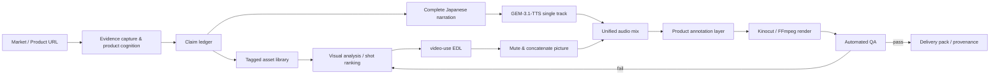

# Product UGC Montage

[中文](README.md) · English

> Evidence-backed product video production for TikTok, Reels, Shorts, and localized ecommerce campaigns.

`product-ugc-montage` is not a random clip concatenator. It is an auditable production skill: lock the market and product evidence, let AI analyze visuals and rank shots by selling point, then deliver with one complete Japanese narration, product annotations, deterministic rendering, and automated QA.

## In one sentence

**AI owns editorial execution; humans retain facts, authorization, and publication decisions.**

The user does not need to touch a timeline. The skill can draft the script, call TTS, build a video EDL, select shots, mix audio, render, score, revise, and package the result. It pauses only when the market is ambiguous, a product claim lacks evidence, or a paid provider call needs confirmation.

## Workflow overview



## Production stages

| Stage | AI responsibility | Key artifacts | Release gate |
|---|---|---|---|
| 0. Route | Identify URL, library, and target market | `market-profile.json` | Country, language, and platform frozen |
| 1. Evidence | Capture product images, SKU, specs, and limitations | `product_manifest.json`, `image_analysis.json` | Evidence and assets map one-to-one |
| 2. Claims | Map buyer problem to visible proof moments | `claim-ledger.json`, benefit ladder | Every line has an evidence source |
| 3. Library | Build multi-angle B-roll and reject identity drift | `library_manifest.json`, reserve set | Identity, usage, L1/L2 QC pass |
| 4. Batch plan | Compute the combination ceiling, review cap, and recommendation | `variant_batch_plan.json` | User confirms `N` before parallel renders |
| 5. Narration | Write one complete Japanese narration; audition GEM and Doubao female voices | `narration_ja.txt` | Complete sentences, locale and commerce-style voice |
| 6. Audio | Generate one GEM track and a pool of passing BGM candidates | Audio, timings, provider receipts | Each variant BGM is 8–12 dB below narration |
| 7. Editorial | Analyze picture and select shots by selling point | One EDL per variant | Shots prove the claims; ending stays dynamic |
| 8. Render | Mute sources, parallelize picture assembly, mix, and annotate | Preview / final MP4 set | CFR, 9:16, no black frames or jumps |
| 9. Release | Run checks per variant and perform bounded revisions | `qa-report.json`, delivery manifest | All quality gates pass |

## Seven immutable audio rules

1. Write **one complete Japanese narration** before timing shots.
2. Use one voice to create one complete **GEM-3.1-TTS** or **Doubao TTS 2.0** narration track; audition female voices first and do not create per-shot fragments.
3. Mute every source-clip audio stream; source ASR is diagnostic only.
4. Use a pool of passing, soft, instrumental BGM candidates; **Suno v4.5 instrumental** is the default candidate, not a mandatory model.
5. Measure the final timeline and keep BGM **8–12 dB below narration**, rather than documenting only a gain multiplier.
6. Any sentence-tail, duration, duplicate-sentence, black-frame, or A/V-sync failure triggers revision instead of silent trimming.
7. Runtime is derived from the real narration: `narration duration + headroom + clean tail`; never hard-code a 15/25/30-second target.

Batch variants may reuse the same complete narration to control cost, but must not be forced onto one BGM track. For `N ≥ 4`, prepare at least two passing BGM candidates by default and assign them by mood or round-robin. If Suno output has hum, single-frequency energy, audible loop seams, vocals, or dramatic drops, mark that candidate failed and switch to an authorized provider/original instrumental; never silently reuse it.

## Technical highlights

### 1. Evidence before copy

Every selling point follows:

```text
Buyer problem → product intervention → visible result → proof shot → narration / annotation
```

The claim ledger separates `confirmed`, `page_claim_needs_visual_proof`, `inferred`, and `rejected`. Inferred area, weather resistance, accessories, or performance guarantees never enter the script automatically.

### 2. Visual intelligence is decoupled from audio production

`video-use` owns visual analysis, selling-point relevance, EDL drafting, and visual QA only. It does not preserve source sound, synthesize narration, or choose music. This avoids dialogue, room-tone, and music discontinuities across independently generated clips.

### 3. Reusable product annotation system

Annotations are short cards bound to proof shots, not full narration captions:

- JSON Schema constrains `start/end/text/claim_id/evidence/anchor/animation`;
- warm-gray translucent card, bold white Japanese, orange `#FF6A00` accent by default;
- safe-zone rules avoid TikTok caption/action UI;
- timing, animation, size, and position are machine-validatable;
- subtitles are opt-in and rendered last.

### 4. Provider adapters with receipts and authorization boundaries

`scripts/providers/updrama_client.py` uses one asynchronous contract for GEM-3.1-TTS and Suno v4.5:

```text
POST /v1/media/generate
        ↓ task_id
GET  /v1/media/status?task_id=...
        ↓ is_final=true && state=success
download result_url + save receipt
```

Each task records model, prompt hash, voice, task id, timestamp, and result URL. Importing the adapter or using dry-run never submits a paid request.

### 5. BGM is not a test signal

Procedural fallbacks must not use a continuous single-frequency sine wave, humming drone, or unfiltered noise. Prefer Suno instrumental; when paid providers are not authorized, use an original chordal/filtered bed and measure the final 8–12 dB narration-to-BGM separation.

### 6. Two scores make quality observable

- **Asset diversity**: angle uniqueness 40%, variant uniqueness 25%, semantic tag spread 20%, metadata completeness 15%, plus cross-selling-point reuse signal.
- **Dynamic ending**: tail-frame motion, tail-source diversity, and freeze/clone penalty; outputs `dynamic`, `borderline`, or `static_risk`.

Default thresholds: diversity `<65` or dynamic ending `<70` automatically triggers EDL revision; `borderline` requires visual review.

### 7. One visual understanding, many parallel montages

After the asset library passes QC, run:

```bash
python3 ~/.agents/skills/product-ugc-montage/scripts/plan_variant_batch.py \
  ./asset_library/library_manifest.json --include-reserve \
  -o ./edit/variant_batch_plan.json
```

The planner reports the theoretical Cartesian combination count, a conservative reviewable hard cap (12 by default), a recommended starting batch (6 by default), and a required user choice for `N`. For the current Japanese canopy library, the reserve-inclusive theoretical ceiling is 48; the suggested first batch is 6 and the reviewable cap is 12. Theoretical combinations are not a publishing promise: collapse near-duplicates, and run independent EDL, annotation, BGM, dynamic-ending, and release checks for every selected variant. Only after the user confirms `N` does the agent render the variants in parallel, using a default worker pool of `min(N, 4)` that can be tuned to host CPU/GPU capacity.

### 8. Auditable local rendering

Prefer Kinocut's typed workflow, `doctor`, preflight, receipts, and release checkpoint. If Kinocut is unavailable, use the same EDL contract with deterministic FFmpeg. The render order is fixed:

```text
extract segments → strip source audio → concatenate picture
→ GEM narration + one BGM bed → product annotations
→ optional subtitles last → preview → final
```

## Tool composition

| Tool | Responsibility in this skill | Explicitly does not own |
|---|---|---|
| `product-ugc-montage` | Market, evidence, claims, authorization, orchestration, release policy | Product truth source |
| `video-use` | Visual understanding, shot ranking, EDL, visual QA | Audio and paid providers |
| [Kinocut](https://github.com/KyaniteLabs/kinocut) | Typed local render, mixing, preflight, receipts, quality gates | Commercial approval |
| [MoneyPrinterTurbo](https://github.com/harry0703/MoneyPrinterTurbo) | Reference for script → TTS → BGM → export batching | Evidence and annotation policy |

## Install and quick start

```bash
git clone https://github.com/peipeijiang/product-ugc-montage.git ~/.agents/skills/product-ugc-montage
```

Run local checks first:

```bash
python3 ~/.agents/skills/product-ugc-montage/scripts/check_env.py --edit-dir ./edit
python3 ~/.agents/skills/product-ugc-montage/scripts/derive_runtime.py ./edit/narration_ja.wav -o ./edit/runtime.json
python3 ~/.agents/skills/product-ugc-montage/scripts/plan_variant_batch.py ./asset_library/library_manifest.json --include-reserve -o ./edit/variant_batch_plan.json
python3 ~/.agents/skills/product-ugc-montage/scripts/validate_annotations.py ./edit/product_annotation_plan.json
python3 ~/.agents/skills/product-ugc-montage/scripts/score_asset_library.py ./asset_library/library_manifest.json
python3 ~/.agents/skills/product-ugc-montage/scripts/score_dynamic_ending.py ./edit/final.mp4 --edl ./edit/video_use_edl.json
python3 ~/.agents/skills/product-ugc-montage/scripts/qa_unified_audio.py ./edit/final.mp4 --narration ./edit/narration_ja.wav --bgm ./edit/bgm.wav --script ./edit/narration_ja.txt --annotations ./edit/product_annotation_plan.json
```

The provider adapter supports dry-run:

```bash
python3 ~/.agents/skills/product-ugc-montage/scripts/providers/updrama_client.py gem \
  'このテントは広くて、日差しや雨の日にも使いやすいです。' \
  --voice-id Zephyr --dry-run
```

A real call requires `UPDRAMA_API_KEY` and explicit paid-audio authorization immediately before submission.

## Repository layout

```text
product-ugc-montage/
├── SKILL.md                         # agent workflow and boundaries
├── README.md / README.en.md         # bilingual project docs
├── agents/openai.yaml               # Codex display metadata
├── references/
│   ├── audio_contract.md             # unified audio contract
│   ├── audio_providers.md            # GEM/Doubao/Suno adapter notes
│   ├── audio_research_industry.md   # Industry audio model and workflow research
│   ├── product_annotation.schema.json
│   ├── product_annotation_template.json
│   ├── tool_research.md
│   └── video_use_risks.md
└── scripts/
    ├── providers/updrama_client.py
    ├── derive_runtime.py
    ├── plan_variant_batch.py
    ├── qa_unified_audio.py
    ├── render_annotations.py
    ├── score_asset_library.py
    ├── score_dynamic_ending.py
    └── validate_annotations.py
```

## Automation boundaries

The agent may revise automatically up to three times. It must stop for:

- unclear market, language, SKU, or product identity;
- an unsupported or conflicting claim;
- unclear provider, voice, BGM license, or spend authorization;
- three consecutive quality failures.

Even after automated checks pass, perform one visual and audio review before publication. The goal is **explainable, reproducible, recoverable AI ownership**, not an unaudited black-box publisher.

## Sources and references

- [Kinocut](https://github.com/KyaniteLabs/kinocut)
- [MoneyPrinterTurbo](https://github.com/harry0703/MoneyPrinterTurbo)
- [video-use](https://github.com/browser-use/video-use)
