# Product UGC Montage

[中文](README.md) · English

> Evidence-backed product video production for TikTok, Reels, Shorts, and localized ecommerce campaigns.

`product-ugc-montage` is not a random clip concatenator. It is an auditable production skill: lock the market and product evidence, let AI analyze visuals and rank shots by selling point, then deliver with one complete target-language narration, product annotations, deterministic rendering, and automated QA.

## In one sentence

**AI owns editorial execution; humans retain facts, authorization, and publication decisions.**

The user does not need to touch a timeline. The skill can draft the script, call TTS, build a video EDL, select shots, mix audio, render, score, revise, and package the result. It pauses only when the market is ambiguous, a product claim lacks evidence, or a paid provider call needs confirmation.

## Workflow overview

```mermaid
flowchart LR
    A[Market / Product URL] --> B[Evidence capture & product cognition]
    B --> C[Claim ledger]
    C --> P[Default 20 ads / source budget]
    P --> O[10s Omni all-purpose reference generation]
    O --> D[Generated video / proof range index]
    D --> E[Visual analysis / shot ranking]
    C --> F[Complete target-language narration]
    F --> G[Separate full GEM/Doubao track per video]
    G --> H[Unified audio mix]
    E --> I[video-use EDL]
    I --> J[Mute & concatenate picture]
    J --> H
    H --> K[Product annotation layer]
    K --> L[Kinocut / FFmpeg render]
    L --> M[Automated QA]
    M -->|fail| E
    M -->|pass| N[Delivery pack / provenance]
```



## Production stages

| Stage | AI responsibility | Key artifacts | Release gate |
|---|---|---|---|
| 0. Route | Identify URL, library, and target market | `market-profile.json` | Country, language, and platform frozen |
| 1. Evidence | Capture product images, SKU, specs, and limitations | `product_manifest.json`, `image_analysis.json` | Evidence and assets map one-to-one |
| 2. Claims | Map buyer problem to visible proof moments | `claim-ledger.json`, benefit ladder | Every line has an evidence source |
| 3. Budget / Library | Reverse-plan from 20 ads and generate 10s Omni all-purpose-reference sources | Source budget, beat matrix, receipts, shot index | No page-image footage, Veo or first/last-frame substitutes |
| 4. Batch plan | Vary claim order, require independent openings, validate capacity | `variant_batch_plan.json` | Meet requested count or report shortfall; never pad |
| 5. Narration | Write one complete target-language narration; audition GEM and Doubao market-compatible voices | `narration_<locale>.txt` | Complete sentences, locale and commerce-style voice |
| 6. Audio | Separate full GEM/Doubao task for every video; selectively shared BGM | Unique task IDs/audio hashes, timings | No shared narration; BGM 8–12 dB below speech |
| 7. Editorial | Analyze picture and select shots by selling point | One EDL per variant | Shots prove the claims; ending stays dynamic |
| 8. Render | Mute sources, parallelize picture assembly, mix, and annotate | Preview / final MP4 set | CFR, 9:16, no black frames or jumps |
| 9. Release | Run checks per variant and perform bounded revisions | `qa-report.json`, delivery manifest | All quality gates pass |

## Seven immutable audio rules

1. Write **one complete target-language narration** before timing shots.
2. Use one voice to create one complete **GEM-3.1-TTS** or **Doubao TTS 2.0** narration track; follow the market voice profile and do not create per-shot fragments.
3. Mute every source-clip audio stream; source ASR is diagnostic only.
4. Use a pool of passing, soft, instrumental BGM candidates; **Suno v4.5 instrumental** is the default candidate, not a mandatory model.
5. Measure the final timeline and keep BGM **8–12 dB below narration**, rather than documenting only a gain multiplier.
6. Any sentence-tail, duration, duplicate-sentence, black-frame, or A/V-sync failure triggers revision instead of silent trimming.
7. Runtime is derived from the real narration: `narration duration + headroom + clean tail`; never hard-code a 15/25/30-second target.

Every selected variant gets an independent, content-matched complete narration script and TTS job. Existing successful jobs may resume from their journal; tracks are never shared or split across videos. For `N ≥ 4`, prepare at least two passing BGM candidates and assign them by mood or round-robin; reject hum, vocals, seams and dramatic drops.

## Technical highlights

### 1. Evidence before copy

Every selling point follows:

```text
Buyer problem → product intervention → visible result → proof shot → narration / annotation
```

The claim ledger separates `confirmed`, `page_claim_needs_visual_proof`, `inferred`, and `rejected`. Inferred area, weather resistance, accessories, or performance guarantees never enter the script automatically.

### 2. Visual intelligence is decoupled from audio production

`video-use` owns visual analysis, selling-point relevance, EDL drafting, and visual QA only. It does not preserve source sound, synthesize narration, or choose music. This avoids dialogue, room-tone, and music discontinuities across independently generated clips.

### 3. Reusable product annotation system

Annotations are short cards bound to proof shots, not full narration captions:

- JSON Schema constrains `start/end/text/claim_id/evidence/anchor/animation`;
- warm-gray translucent card, bold white target-language text, orange `#FF6A00` accent by default;
- safe-zone rules avoid TikTok caption/action UI;
- timing, animation, size, and position are machine-validatable;
- subtitles are opt-in and rendered last.

### 4. Provider adapters with receipts and authorization boundaries

`scripts/providers/updrama_client.py` uses one asynchronous contract for GEM-3.1-TTS, Doubao TTS 2.0, and Suno v4.5:

```text
POST /v1/media/generate
        ↓ task_id
GET  /v1/media/status?task_id=...
        ↓ is_final=true && state=success
download result_url + save receipt
```

Each task records model, prompt hash, voice, task id, timestamp, and result URL. Importing the adapter or using dry-run never submits a paid request.

### 5. BGM is not a test signal

Procedural fallbacks must not use a continuous single-frequency sine wave, humming drone, or unfiltered noise. Prefer Suno instrumental; when Suno fails, accept only a user-provided or license-confirmed local music file. No local AI music model is currently configured, so the workflow must not auto-download a model or fabricate an “original” bed; stop and report the missing fallback when no authorized file exists.

### 6. Two scores make quality observable

- **Asset diversity**: angle uniqueness 35%, range uniqueness 25%, semantic tag spread 20%, and coverage 20%; overlapping ranges or repeated visual clusters invalidate a selected edit.
- **Dynamic ending**: motion in the clean picture tail; outputs `dynamic` or `needs_visual_review`, without mistaking annotation animation for product movement.

Default thresholds: diversity `<65` or ending `<70` requires visual review and revision when a defect is confirmed. Heuristic scores do not prove perceptual quality.

### 7. One visual understanding, many parallel montages

Default target: **20 distinct-opening ads**. Budget sources and proof beats before generation, then record observed ranges and validate actual post-QC capacity:

```bash
python3 ~/.agents/skills/product-ugc-montage/scripts/plan_variant_batch.py \
  ./asset_library/library_manifest.json --include-reserve \
  -o ./edit/variant_batch_plan.json
```

The planner reports theoretical combinations, actual candidates, unique hooks and shortfall against target 20 (or the explicit user count). No two outputs may reuse an opening visual cluster or overlapping source range in their first 3s. Claim order may vary; changing text/crop/music alone is not a new opening. Insufficient capacity exits 2 rather than silently shrinking or padding the batch.

Conservative example: three compatible confirmed claims and 20 requested ads imply 20 planned independent opening containers plus 25% reserve: **25 proposed 10s source requests**, each covering 2–3 separately usable proof beats. This is an assumption-based budget, not a universal minimum or a guarantee. Real narration runtime, failures and visual duplication can require extra sources.

Product-page photos are reference/evidence only, never timeline footage. `generate_montage_sources.py` fixes Omni all-purpose references and 10s; source admission checks canonical receipts, hashes, decoded video duration and observed motion QC. `validate_batch.py` rejects repeated scripts, narration audio/tasks and opening footage; passing BGM may be shared selectively. Actual rendered-opening comparison and per-video release QA remain mandatory. See the [batch production contract](references/batch_production.md).

### 8. Auditable local rendering

Prefer Kinocut's typed workflow, `doctor`, preflight, receipts, and release checkpoint. If Kinocut is unavailable, use the same EDL contract with deterministic FFmpeg. The render order is fixed:

```text
extract segments → strip source audio → concatenate picture
→ GEM narration + one BGM bed → product annotations
→ optional subtitles last → preview → final
```

## Tool composition

| Tool | Responsibility in this skill | Explicitly does not own |
|---|---|---|
| `product-ugc-montage` | Market, evidence, claims, authorization, orchestration, release policy | Product truth source |
| `video-use` | Visual understanding, shot ranking, EDL, visual QA | Audio and paid providers |
| [Kinocut](https://github.com/KyaniteLabs/kinocut) | Typed local render, mixing, preflight, receipts, quality gates | Commercial approval |
| [MoneyPrinterTurbo](https://github.com/harry0703/MoneyPrinterTurbo) | Reference for script → TTS → BGM → export batching | Evidence and annotation policy |

## Install and quick start

```bash
git clone https://github.com/peipeijiang/product-ugc-montage.git ~/.agents/skills/product-ugc-montage
```

Run local checks first:

```bash
python3 ~/.agents/skills/product-ugc-montage/scripts/check_env.py --edit-dir ./edit --market-profile ./analysis/market-profile.json
python3 ~/.agents/skills/product-ugc-montage/scripts/fingerprint_shots.py ./asset_library/library-draft.json -o ./asset_library/library-indexed.json
python3 ~/.agents/skills/product-ugc-montage/scripts/plan_variant_batch.py ./asset_library/library-indexed.json --include-reserve -o ./edit/variant_batch_plan.json
# Run plan_source_budget.py BEFORE generation; post-QC planning targets 20 by default.
# A capacity shortfall is reported with exit 2, never silently padded or reduced.
# See references/executable_contracts.md for complete EDL, overlay, ending and audio QA commands.
```

The provider adapter supports dry-run:

```bash
python3 ~/.agents/skills/product-ugc-montage/scripts/providers/updrama_client.py gem \
  'このテントは広くて、日差しや雨の日にも使いやすいです。' \
  --voice-id Zephyr --dry-run
```

A real call requires `UPDRAMA_API_KEY`, a unique durable `--journal` per logical task, and explicit paid-audio authorization immediately before submission.

## Repository layout

```text
product-ugc-montage/
├── SKILL.md                         # agent workflow and boundaries
├── README.md / README.en.md         # bilingual project docs
├── agents/openai.yaml               # Codex display metadata
├── references/
│   ├── audio_contract.md             # unified audio contract
│   ├── audio_providers.md            # GEM/Doubao/Suno adapter notes
│   ├── audio_research_industry.md   # Industry audio model and workflow research
│   ├── product_annotation.schema.json
│   ├── product_annotation_template.json
│   ├── tool_research.md
│   └── video_use_risks.md
└── scripts/
    ├── providers/updrama_client.py
    ├── derive_runtime.py
    ├── plan_variant_batch.py
    ├── qa_unified_audio.py
    ├── render_annotations.py
    ├── score_asset_library.py
    ├── score_dynamic_ending.py
    └── validate_annotations.py
```

## Automation boundaries

The agent may revise automatically up to three times. It must stop for:

- unclear market, language, SKU, or product identity;
- an unsupported or conflicting claim;
- unclear provider, voice, BGM license, or spend authorization;
- three consecutive quality failures.

Even after automated checks pass, perform one visual and audio review before publication. The goal is **explainable, reproducible, recoverable AI ownership**, not an unaudited black-box publisher.

## Sources and references

- [Kinocut](https://github.com/KyaniteLabs/kinocut)
- [MoneyPrinterTurbo](https://github.com/harry0703/MoneyPrinterTurbo)
- [video-use](https://github.com/browser-use/video-use)
