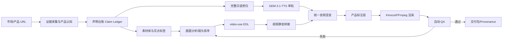

# Product UGC Montage

中文 · [English](README.en.md)

> Evidence-backed product video production for TikTok, Reels, Shorts, and localized ecommerce campaigns.

`product-ugc-montage` 不是一个“随机拼接素材”的脚本，而是一套可审计的产品视频生产 skill：先锁定市场与产品证据，再让 AI 分析画面、按买点选镜头，最后用统一日语旁白、产品标注和自动质检交付成片。

## 一句话定位

**AI 接管剪辑执行，人保留事实、授权和发布决策。**

用户无需操作时间线。skill 可以自动生成脚本、调用 TTS、建立视频 EDL、编排镜头、混音、渲染、评分、返工和打包；只有市场不明确、产品声明缺证据或付费调用需要确认时才会暂停。

## 工作流总览



## 标准生产阶段

| 阶段 | AI 负责 | 关键产物 | 放行条件 |
|---|---|---|---|
| 0. Route | 识别 URL、素材库和目标市场 | `market-profile.json` | 国家、语言、平台明确并冻结 |
| 1. Evidence | 采集商品图、SKU、规格和页面限制 | `product_manifest.json`、`image_analysis.json` | 素材与证据一一对应 |
| 2. Claims | 将买家问题映射到可见证明瞬间 | `claim-ledger.json`、benefit ladder | 每条文案都有证据来源 |
| 3. Library | 生成/整理多角度 B-roll，淘汰身份漂移 | `library_manifest.json`、reserve set | 通过 identity、usage、L1/L2 QC |
| 4. Batch plan | 计算组合上限、可复核上限和建议批量 | `variant_batch_plan.json` | 用户确认 `N` 后才并发渲染 |
| 5. Narration | 写一条完整自然的日语旁白 | `narration_ja.txt` | 句子完整、市场语言一致 |
| 6. Audio | GEM-3.1-TTS 单轨；准备多个合格 BGM 候选 | 音频、时间戳、provider receipts | 每个变体 BGM 低 8–12 dB |
| 7. Editorial | 只分析画面、按买点选择镜头 | 每个变体一份 EDL | 镜头证明买点、结尾有动态 |
| 8. Render | 静音源片、并发拼接、混音、叠加标注 | preview / final MP4 set | CFR、9:16、无黑帧/跳切 |
| 9. Release | 每个变体自动检查并限次返工 | `qa-report.json`、delivery manifest | 全部质量门禁通过 |

## 七条不可变音频规则

1. 先写**一条完整的日语旁白**，再决定镜头时长。
2. 用同一个 voice 生成一条完整的 **GEM-3.1-TTS** 音轨，不把旁白拆成镜头碎片。
3. 所有源片音频统一 `mute` / `-an`；源片 ASR 只能帮助理解画面，不能进入最终混音。
4. 使用通过质检的轻柔、无 vocals BGM 候选池；默认候选为 **Suno v4.5 instrumental**，不是强制模型。
5. 在最终时间线上测量响度，让 BGM 比旁白低 **8–12 dB**，而不是只记录一个音量倍率。
6. 句尾、音画时长、重复句、黑帧、音画同步任一失败，都要返工而不是静默截断。
7. 成片时长由旁白实际时长推导：`旁白时长 + 前置 headroom + 结尾 clean tail`，不写死 15/25/30 秒。

批量变体允许复用同一条完整旁白来控制成本，但不能强制所有变体使用同一首 BGM。`N ≥ 4` 时默认准备至少两个通过质检的 BGM 候选，按情绪或轮换策略分配；若 Suno 输出出现嗡鸣、单频、明显循环接缝、人声或戏剧性 drop，则标记候选失败并切换已授权 provider/原创器乐，不静默沿用。

## 技术亮点

### 1. 证据驱动，而不是先写夸张文案

每个 selling point 都经过：

```text
买家问题 → 产品干预 → 可见结果 → 证明镜头 → 日语旁白/产品标注
```

声明台账区分 `confirmed`、`page_claim_needs_visual_proof`、`inferred` 和 `rejected`。推断出来的面积、耐候性、配件或性能保证不会自动进入脚本。

### 2. 画面智能与音频生产解耦

`video-use` 只做视觉分析、买点相关性排序、EDL 草拟和视觉 QA；它不保留源片声音、不生成旁白、不擅自选择音乐。这样可以避免多条生成视频之间的对白、房间声和音乐断裂。

### 3. 可复用产品标注系统

标注不是把旁白整段烧成字幕，而是绑定到证明镜头的短卡片：

- JSON Schema 约束 `start/end/text/claim_id/evidence/anchor/animation`；
- 默认暖灰半透明卡片、白色日文粗体、橙色 `#FF6A00` 重点；
- 安全区避开 TikTok 底部 caption/action UI；
- 标注时长、入场动画、字号和位置均可程序化验证；
- 字幕仅在用户明确要求时添加，并且最后渲染。

### 4. Provider adapter 有任务回执和授权边界

`scripts/providers/updrama_client.py` 对 GEM-3.1-TTS 和 Suno v4.5 使用统一异步接口：

```text
POST /v1/media/generate
        ↓ task_id
GET  /v1/media/status?task_id=...
        ↓ is_final=true && state=success
下载 result_url + 保存 receipt
```

每次任务保留 model、prompt hash、voice、task id、时间和结果地址；adapter import 或 dry-run 都不会偷偷发起付费请求。

### 5. 音频不是测试信号

程序化 fallback 不能使用持续单频正弦波、嗡嗡 drone 或未经滤波的底噪。优先使用 Suno 无人声器乐；未授权付费 provider 时，使用和弦式、滤波后的原创音床，并在最终时间线上测量旁白与 BGM 的 8–12 dB 相对差。

### 6. 两层评分让“好不好”可观测

- **素材多样性评分**：镜头角度 40%、variant 唯一性 25%、语义标签扩散 20%、元数据完整度 15%，另加跨买点复用惩罚/奖励。
- **动态结尾评分**：结尾帧差异运动量、尾段来源多样性、冻结/克隆惩罚，输出 `dynamic / borderline / static_risk`。

默认阈值：素材多样性 `<65` 或动态结尾 `<70` 时自动触发重新排 EDL；`borderline` 必须进入视觉复核。

### 7. 一次理解、多条并发混剪

素材库完成并通过 QC 后，运行：

```bash
python3 ~/.agents/skills/product-ugc-montage/scripts/plan_variant_batch.py \
  ./asset_library/library_manifest.json --include-reserve \
  -o ./edit/variant_batch_plan.json
```

规划器会给出：

- 理论组合数：各买点镜头选择的笛卡尔积；
- 可复核硬上限：默认 12 条，避免近似重复和 QA 失控；
- 推荐首批：默认 6 条，用于第一轮 A/B 测试；
- 必须由用户决定的 `N`。

以当前日本 canopy 素材库为例：包含 reserve 时理论组合为 48，建议首批 6，最多建议同时进入投放级复核 12 条。48 是数学组合上限，不是建议全部发布；每条仍需独立 EDL、标注、BGM、动态结尾和发布门禁。用户确认 `N` 后，AI 才并发生成 `N` 条变体，默认 worker pool 为 `min(N, 4)`，可按主机 CPU/GPU 调整。

### 8. 可审计的本地渲染

优先使用 Kinocut 的 typed workflow、`doctor`、preflight、receipt 和 release checkpoint；没有 Kinocut 时使用同一 EDL 规则的 FFmpeg fallback。渲染顺序固定为：

```text
逐段取片 → 去除源音频 → 视频拼接 → GEM 旁白 + 单条 BGM
→ 产品标注 →（可选）字幕最后添加 → preview → final
```

## 工具组合

| 工具 | 在本 skill 中的职责 | 不负责什么 |
|---|---|---|
| `product-ugc-montage` | 市场、证据、声明、授权、编排和最终放行 | 不替代产品事实来源 |
| `video-use` | 画面理解、镜头排序、EDL、视觉 QA | 不接管音频和付费 provider |
| [Kinocut](https://github.com/KyaniteLabs/kinocut) | 本地 typed render、混音、preflight、receipt、质量门禁 | 不替代商业审批 |
| [MoneyPrinterTurbo](https://github.com/harry0703/MoneyPrinterTurbo) | 参考脚本→TTS→BGM→导出的批处理架构 | 不覆盖本 skill 的证据和标注策略 |

## 安装与快速开始

```bash
git clone https://github.com/peipeijiang/product-ugc-montage.git ~/.agents/skills/product-ugc-montage
```

建议先做本地检查：

```bash
python3 ~/.agents/skills/product-ugc-montage/scripts/check_env.py --edit-dir ./edit
python3 ~/.agents/skills/product-ugc-montage/scripts/derive_runtime.py ./edit/narration_ja.wav -o ./edit/runtime.json
python3 ~/.agents/skills/product-ugc-montage/scripts/plan_variant_batch.py ./asset_library/library_manifest.json --include-reserve -o ./edit/variant_batch_plan.json
python3 ~/.agents/skills/product-ugc-montage/scripts/validate_annotations.py ./edit/product_annotation_plan.json
python3 ~/.agents/skills/product-ugc-montage/scripts/score_asset_library.py ./asset_library/library_manifest.json
python3 ~/.agents/skills/product-ugc-montage/scripts/score_dynamic_ending.py ./edit/final.mp4 --edl ./edit/video_use_edl.json
python3 ~/.agents/skills/product-ugc-montage/scripts/qa_unified_audio.py ./edit/final.mp4 --narration ./edit/narration_ja.wav --bgm ./edit/bgm.wav --script ./edit/narration_ja.txt --annotations ./edit/product_annotation_plan.json
```

provider adapter 支持 dry-run：

```bash
python3 ~/.agents/skills/product-ugc-montage/scripts/providers/updrama_client.py gem \
  'このテントは広くて、日差しや雨の日にも使いやすいです。' \
  --voice-id Zephyr --dry-run
```

真实调用需要 `UPDRAMA_API_KEY`，并且必须在提交前获得明确的付费授权。

## 目录结构

```text
product-ugc-montage/
├── SKILL.md                         # agent 工作流与边界
├── README.md / README.en.md         # 双语项目文档
├── agents/openai.yaml               # Codex 展示信息
├── references/
│   ├── audio_contract.md             # 统一音频契约
│   ├── audio_providers.md            # GEM/Suno adapter 说明
│   ├── product_annotation.schema.json
│   ├── product_annotation_template.json
│   ├── tool_research.md
│   └── video_use_risks.md
└── scripts/
    ├── providers/updrama_client.py
    ├── derive_runtime.py
    ├── plan_variant_batch.py
    ├── qa_unified_audio.py
    ├── render_annotations.py
    ├── score_asset_library.py
    ├── score_dynamic_ending.py
    └── validate_annotations.py
```

## 自动放行与停止条件

自动返工最多三轮。以下情况必须停止并请求确认：

- 市场、语言、SKU 或产品身份不明确；
- 声明没有证据或与页面信息冲突；
- provider、voice、BGM 授权或费用不明确；
- 质量检查连续三轮失败。

即使自动流程全部通过，发布前仍需完成一次视觉与音频复核。skill 追求的是**可解释、可复现、可回滚的 AI 接管**，不是无审计的黑盒自动发布。

## 项目来源与参考

- [Kinocut](https://github.com/KyaniteLabs/kinocut)
- [MoneyPrinterTurbo](https://github.com/harry0703/MoneyPrinterTurbo)
- [video-use](https://github.com/browser-use/video-use)
