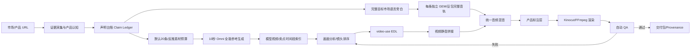

# Product UGC Montage

中文 · [English](README.en.md)

> Evidence-backed product video production for TikTok, Reels, Shorts, and localized ecommerce campaigns.

`product-ugc-montage` 不是一个“随机拼接素材”的脚本，而是一套可审计的产品视频生产 skill：先锁定市场与产品证据，再让 AI 分析画面、按买点选镜头，最后用统一目标市场语言旁白、产品标注和自动质检交付成片。

## 一句话定位

**AI 接管剪辑执行，人保留事实、授权和发布决策。**

用户无需操作时间线。skill 可以自动生成脚本、调用 TTS、建立视频 EDL、编排镜头、混音、渲染、评分、返工和打包；只有市场不明确、产品声明缺证据或付费调用需要确认时才会暂停。

## 工作流总览



## 标准生产阶段

| 阶段 | AI 负责 | 关键产物 | 放行条件 |
|---|---|---|---|
| 0. Route | 识别 URL、素材库和目标市场 | `market-profile.json` | 国家、语言、平台明确并冻结 |
| 1. Evidence | 采集商品图、SKU、规格和页面限制 | `product_manifest.json`、`image_analysis.json` | 素材与证据一一对应 |
| 2. Claims | 将买家问题映射到可见证明瞬间 | `claim-ledger.json`、benefit ladder | 每条文案都有证据来源 |
| 3. Budget / Library | 从默认 20 条反推素材与卖点；生成 10s Omni 全能参考视频 | 素材预算、分镜矩阵、模型回执、镜头索引 | 不允许商品图转视频、Veo、首尾帧替代 |
| 4. Batch plan | 卖点重排、独立开头、去重及容量验证 | `variant_batch_plan.json` | 达到请求数量；不足报告缺口，不凑数 |
| 5. Narration | 写一条完整自然的目标市场语言旁白；比较 符合市场音色配置的 GEM 与豆包候选 | `narration_<locale>.txt` | 句子完整、市场语言一致、音色适合当地带货 |
| 6. Audio | 每条独立 GEM/豆包完整音轨；BGM 可适当共用 | 独立 task ID、音频 hash、时间戳 | 禁止共用配音；BGM 低 8–12 dB |
| 7. Editorial | 只分析画面、按买点选择镜头 | 每个变体一份 EDL | 镜头证明买点、结尾有动态 |
| 8. Render | 静音源片、并发拼接、混音、叠加标注 | preview / final MP4 set | CFR、9:16、无黑帧/跳切 |
| 9. Release | 每个变体自动检查并限次返工 | `qa-report.json`、delivery manifest | 全部质量门禁通过 |

## 七条不可变音频规则

1. 先按冻结市场写**一条完整的目标语言旁白**，再决定镜头时长。
2. 用同一个 voice 生成一条完整的 **GEM-3.1-TTS** 或 **豆包 TTS 2.0** 音轨，不把旁白拆成镜头碎片；默认先 audition 女声，再选适合当地带货风格的音色。
3. 所有源片音频统一 `mute` / `-an`；源片 ASR 只能帮助理解画面，不能进入最终混音。
4. 使用通过质检的轻柔、无 vocals BGM 候选池；默认候选为 **Suno v4.5 instrumental**，不是强制模型。
5. 在最终时间线上测量响度，让 BGM 比旁白低 **8–12 dB**，而不是只记录一个音量倍率。
6. 句尾、音画时长、重复句、黑帧、音画同步任一失败，都要返工而不是静默截断。
7. 成片时长由旁白实际时长推导：`旁白时长 + 前置 headroom + 结尾 clean tail`，不写死 15/25/30 秒。

每个批量变体都必须有自己的完整旁白脚本和独立 TTS 任务，不能跨视频复用或拆分音轨；不变的已成功任务可通过 journal 恢复。不同变体不能强制使用同一首 BGM。`N ≥ 4` 时默认准备至少两个通过质检的 BGM 候选，按情绪或轮换策略分配；若 Suno 输出出现嗡鸣、单频、明显循环接缝、人声或戏剧性 drop，则标记候选失败并切换已授权 provider/原创器乐，不静默沿用。

## 技术亮点

### 1. 证据驱动，而不是先写夸张文案

每个 selling point 都经过：

```text
买家问题 → 产品干预 → 可见结果 → 证明镜头 → 目标市场语言旁白/产品标注
```

声明台账区分 `confirmed`、`page_claim_needs_visual_proof`、`inferred` 和 `rejected`。推断出来的面积、耐候性、配件或性能保证不会自动进入脚本。

### 2. 画面智能与音频生产解耦

`video-use` 只做视觉分析、买点相关性排序、EDL 草拟和视觉 QA；它不保留源片声音、不生成旁白、不擅自选择音乐。这样可以避免多条生成视频之间的对白、房间声和音乐断裂。

### 3. 可复用产品标注系统

标注不是把旁白整段烧成字幕，而是绑定到证明镜头的短卡片：

- JSON Schema 约束 `start/end/text/claim_id/evidence/anchor/animation`；
- 默认暖灰半透明卡片、目标市场语言白色粗体、橙色 `#FF6A00` 重点；
- 安全区避开 TikTok 底部 caption/action UI；
- 标注时长、入场动画、字号和位置均可程序化验证；
- 字幕仅在用户明确要求时添加，并且最后渲染。

### 4. Provider adapter 有任务回执、三模型适配和授权边界

`scripts/providers/updrama_client.py` 对 GEM-3.1-TTS、豆包 TTS 2.0 和 Suno v4.5 使用统一异步接口：

```text
POST /v1/media/generate
        ↓ task_id
GET  /v1/media/status?task_id=...
        ↓ is_final=true && state=success
下载 result_url + 保存 receipt
```

每次任务保留 model、prompt hash、voice、task id、时间和结果地址；adapter import 或 dry-run 都不会偷偷发起付费请求。

### 5. 音频不是测试信号

程序化 fallback 不能使用持续单频正弦波、嗡嗡 drone 或未经滤波的底噪。优先使用 Suno 无人声器乐；Suno 不合格时只接受用户提供或已确认授权的本地音乐文件。当前未配置本地 AI 音乐模型，也不会自动下载模型或伪造原创音床；没有授权本地音乐时，音频路径应停下并报告缺口。

### 6. 两层评分让“好不好”可观测

- **素材多样性评分**：角度唯一性 35%、范围唯一性 25%、语义标签扩散 20%、覆盖度 20%；重叠范围或重复视觉簇会直接使选定编辑不可用。
- **动态结尾评分**：检查无标注画面的尾段运动量，输出 `dynamic / needs_visual_review`，避免把文字动画误当作产品运动。

默认阈值：素材多样性 `<65` 或动态结尾 `<70` 时进入复核，确认缺陷再重新排 EDL；评分不等于视觉质量证明。

### 7. 一次理解、多条并发混剪

默认目标是 **20 条不同开头的混剪视频**：先从已确认卖点反推素材预算和 10 秒分镜，再生成、质检、记录实际卖点时间段，最后验证容量：

```bash
python3 ~/.agents/skills/product-ugc-montage/scripts/plan_variant_batch.py \
  ./asset_library/library_manifest.json --include-reserve \
  -o ./edit/variant_batch_plan.json
```

规划器会给出：

- 理论组合数：各买点镜头选择的笛卡尔积；
- 默认目标和搜索上限 20 条，用户明确数量可覆盖；
- 实际独立开头数量、低重复候选数量、还差多少条；
- 每条前 3 秒不得复用同一视觉簇或重叠源片范围，卖点顺序可变化。

保守预算示例：3 个已确认且兼容的卖点、目标 20 条，规划 20 个不同开头的 10 秒素材容器，另加 25% 淘汰余量，共 **25 条待审批源素材**；每条安排 2–3 个可独立取用的证明镜头。这是有假设的预算，不是固定最低值，也不保证必出 20 条。实际时长、生成失败或近似重复会触发补素材建议，不会强行定格/循环。

网页商品图只能作为模型参考，不能直接变成广告镜头。`generate_montage_sources.py` 强制 Omni 全能参考 + 10 秒；入库核验模型回执、参考哈希、真实视频时长和运动复核。`validate_batch.py` 拒绝跨视频重复完整脚本、配音音频/任务及开头；合格 BGM 可适当共用。另需对所有成片的前 3 秒做实际视觉对比，不能只换文案或裁切冒充新开头。完整协议见 [批量生产契约](references/batch_production.md)。

### 8. 可审计的本地渲染

优先使用 Kinocut 的 typed workflow、`doctor`、preflight、receipt 和 release checkpoint；没有 Kinocut 时使用同一 EDL 规则的 FFmpeg fallback。渲染顺序固定为：

```text
逐段取片 → 去除源音频 → 视频拼接 → GEM 旁白 + 单条 BGM
→ 产品标注 →（可选）字幕最后添加 → preview → final
```

## 工具组合

| 工具 | 在本 skill 中的职责 | 不负责什么 |
|---|---|---|
| `product-ugc-montage` | 市场、证据、声明、授权、编排和最终放行 | 不替代产品事实来源 |
| `video-use` | 画面理解、镜头排序、EDL、视觉 QA | 不接管音频和付费 provider |
| [Kinocut](https://github.com/KyaniteLabs/kinocut) | 本地 typed render、混音、preflight、receipt、质量门禁 | 不替代商业审批 |
| [MoneyPrinterTurbo](https://github.com/harry0703/MoneyPrinterTurbo) | 参考脚本→TTS→BGM→导出的批处理架构 | 不覆盖本 skill 的证据和标注策略 |

## 安装与快速开始

```bash
git clone https://github.com/peipeijiang/product-ugc-montage.git ~/.agents/skills/product-ugc-montage
```

建议先做本地检查：

```bash
python3 ~/.agents/skills/product-ugc-montage/scripts/check_env.py --edit-dir ./edit --market-profile ./analysis/market-profile.json
python3 ~/.agents/skills/product-ugc-montage/scripts/fingerprint_shots.py ./asset_library/library-draft.json -o ./asset_library/library-indexed.json
python3 ~/.agents/skills/product-ugc-montage/scripts/plan_variant_batch.py ./asset_library/library-indexed.json --include-reserve -o ./edit/variant_batch_plan.json
# 生成前先运行 plan_source_budget.py；生成后默认验证 20 条容量，不足退出 2 并报告缺口。
# 完整 EDL、标注渲染、动态结尾和音频 QA 命令见 references/executable_contracts.md。
```

provider adapter 支持 dry-run：

```bash
python3 ~/.agents/skills/product-ugc-montage/scripts/providers/updrama_client.py gem \
  'このテントは広くて、日差しや雨の日にも使いやすいです。' \
  --voice-id Zephyr --dry-run

python3 ~/.agents/skills/product-ugc-montage/scripts/providers/updrama_client.py doubao \
  'このテントは広くて、日差しや雨の日にも使いやすいです。' \
  --voice-id <catalog-market-compatible> --emotion calm --dry-run
```

真实调用需要 `UPDRAMA_API_KEY`，还必须提供每个逻辑任务独立的 `--journal`，并在提交前获得明确的付费授权。

## 目录结构

```text
product-ugc-montage/
├── SKILL.md                         # agent 工作流与边界
├── README.md / README.en.md         # 双语项目文档
├── agents/openai.yaml               # Codex 展示信息
├── references/
│   ├── audio_contract.md             # 统一音频契约
│   ├── audio_providers.md            # GEM/Doubao/Suno adapter 说明
│   ├── audio_research_industry.md   # 原生音频、AI 配乐与配音选型
│   ├── product_annotation.schema.json
│   ├── product_annotation_template.json
│   ├── tool_research.md
│   └── video_use_risks.md
└── scripts/
    ├── providers/updrama_client.py
    ├── derive_runtime.py
    ├── plan_variant_batch.py
    ├── qa_unified_audio.py
    ├── render_annotations.py
    ├── score_asset_library.py
    ├── score_dynamic_ending.py
    └── validate_annotations.py
```

## 自动放行与停止条件

自动返工最多三轮。以下情况必须停止并请求确认：

- 市场、语言、SKU 或产品身份不明确；
- 声明没有证据或与页面信息冲突；
- provider、voice、BGM 授权或费用不明确；
- 质量检查连续三轮失败。

即使自动流程全部通过，发布前仍需完成一次视觉与音频复核。skill 追求的是**可解释、可复现、可回滚的 AI 接管**，不是无审计的黑盒自动发布。

## 项目来源与参考

- [Kinocut](https://github.com/KyaniteLabs/kinocut)
- [MoneyPrinterTurbo](https://github.com/harry0703/MoneyPrinterTurbo)
- [video-use](https://github.com/browser-use/video-use)
